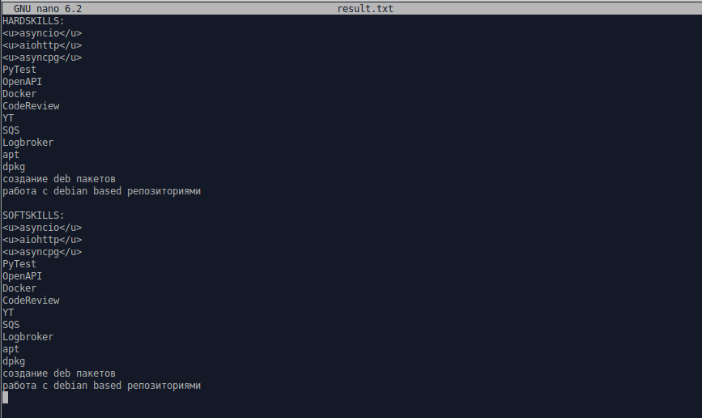

Скиллы должны быть указаны без опечаток проверяются только дубли.
Скилл желательно указывать в формате 1 слова:
Пример:
MySQL
SQL
Postgress
SQL
PYTHON

<ul>
	<li>Записываете хард скиллы в файл hard.txt</li>
	<li>Записываете софт скилы soft.txt(в прочем с этим труднее)</li>
	<li>python3 main.py</li>
	<li>Добавляете оценки к своим навыкам, копируете из results.txt на стену</li>
	<li>PROFIT</li>
</ul>

Если что то пошло не так просто удалите файл result.txt

touch hard.txt soft.txt

//
// PARSE SITE > REQUEST > WALL_POST

###@saintbyte:+1

#адскийчеллендж_хк @habr_career